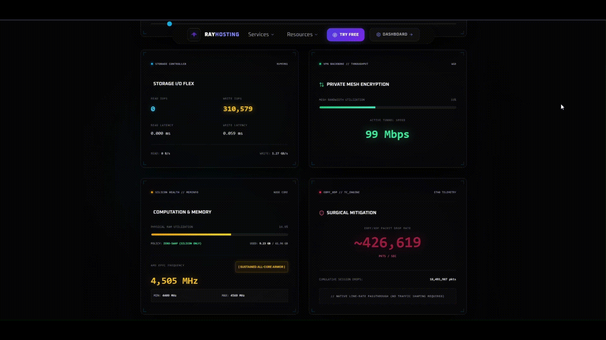

Bare-Metal Network Shield (eBPF + nftables)

I pulled my network mitigation code out of my bare-metal orchestrator project. Hosting game servers means dealing with DDoS garbage constantly, and I quickly found out that standard firewalls just choke the CPU to death with hardware interrupts during high-PPS floods, which causes the game containers to desync and eventually kill the host node.

This is the hybrid setup I ended up with to kill the traffic before the CPU utilization goes 100%.

## The UFW / Docker Nightmare
Warning if you're deploying this: don't use UFW. I wasted a lot of time trying to get UFW and Docker's standalone iptables NAT rules to cooperate but that was not possible. 

This setup ignores UFW completely. It injects a custom nftables chain at priority -150 so it catches packets *before* Docker.
```nftables
chain raw_checks { type filter hook prerouting priority -150; policy accept; }
```

## How it Actually Works (The Duct-Tape)

I split the work into two layers:

**1. State Tracking (nftables):** 
nftables handles the actual per-port logic. TCP gets hard bans for socket exhaustion. UDP is trickier—I use a soft-throttle for reconnect storms (so legit players don't get banned) and an extreme limit for actual floods. If an IP trips that extreme limit, it gets dumped into an @blacklist set for 300 seconds.
```nftables
set blacklist { type ipv4_addr; flags dynamic, timeout; size 65535; timeout 300s; }
ip saddr @blacklist counter name ddos_blacklist_drops drop
```

**2. The Fast Drop (eBPF + Systemd Service)**
nftables alone cannot survive a massive 500k PPS flood on its own. I didn't want to bake the sync logic into my main application, so I wrote a separate systemd-managed service to handle it.

The daemon just watches the nftables blacklist and synchronizes those IPs down into an eBPF map using xdp-tools. Once an IP is in that map, the XDP program drops the packets directly at the NIC driver level.
```bash
xdp-filter load eth0 -f ipv4,ipv6 --mode native
xdp-filter ip -m src "$ip"
```

(The caveat: Because the daemon polls and syncs the rules every 2 seconds, there is a window of up to two seconds where the initial flood packets hit the kernel before the map updates. It's not perfect, but it prevents the CPU from locking up during a sustained attack).

## Sysctl Tweaks (Mandatory)
Inside GameNodeShellOperations.cs, there are two kernel tweaks I had to add to keep game servers stable:
* **16MB UDP Buffers:** Bumping rmem_max and wmem_max. using the default *~200KB* buffers will make bursty games like Rust silently drop packets during heavy action and the server threads will stall and cause rubber-banding.
* **TCP BBR:** I moved off CUBIC congestion control. CUBIC assumes any packet loss is network congestion, which causes rubber-banding. BBR plays way nicer with game traffic.
```ini
net.core.rmem_max = 16777216
net.ipv4.tcp_congestion_control = bbr
```

## Stress Testing & Current Issues

I tested this on my production AMD EPYC game node with a UDP flood that peaked around 500k PPS. The eBPF program kept the CPU interrupt load low enough that the servers stayed responsive for about 34 seconds, right up until my upstream provider null-routed the box to protect their core network. 



You can replay the full 22-minute stress-test here if you wish: 
**[Performance Audit](https://ray-hosting.com/en-US/performance-audit)**


**Things that still need fixing:**
* If a node hard-reboots while a server is provisioning, the C# GC worker sometimes leaves orphaned nftables chains behind. The garbage_collect_nft.sh script eventually cleans them up, but it's janky.
* The C# SSH execution could probably be optimized, right now it just opens a new session per GC run.

---
*I use this exact system for [Ray Hosting](https://ray-hosting.com), mainly because I'm a solo dev and couldn't afford enterprise hardware mitigation, and it actually works perfectly.*"